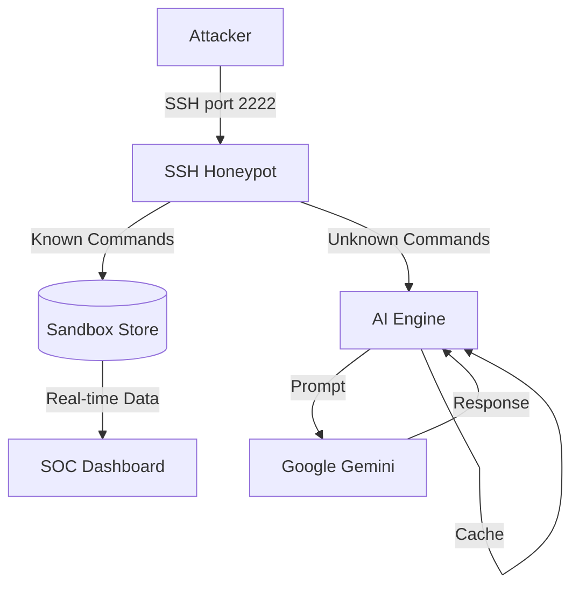

# 🛡️ AdaptiveWardens: AI-Driven Adaptive Honeypot

AdaptiveWardens is an AI-powered honeypot that simulates a realistic, compromised Ubuntu server. By leveraging **Google Gemini**, it generates consistent and believable responses to unknown attacker commands while logging all activity for analysis on a real-time dashboard.

---

## 🚀 Quick Start

### 1. Clone & Enter
```bash
git clone https://github.com/Aligithyb/-AdaptiveWardens.git
cd AdaptiveWardens
```

### 2. Configure Environment
You only need **one** `.env` file in the root directory. This file manages all services.

```bash
# Copy the example to start
cp .env.example .env
```

**Required Keys:**
- **Gemini API Key**: Get it at [ai.studio.google.com](https://aistudio.google.com/app/apikey).
- **Slack Configuration**: See the [Slack Setup](#-slack-alerts-setup) section below.

### 3. Launch
```bash
./start.sh
```

---

## 🏗️ Architecture



| Service | Port | Description |
|---|---|---|
| `ssh-frontend` | 2222 | The honeypot entry point (Accepts any login). |
| `ai-engine` | 8002 | Generates realistic shell output via Gemini. |
| `sandbox-store` | 8001 | Centralized API for session state & logs. |
| `dashboard` | 3000 | Next.js interface for monitoring attacks. |

---

## 📢 Slack Alerts Setup

AdaptiveWardens can notify you instantly when a new session starts.

### 1. Create a Slack App
1. Go to [api.slack.com/apps](https://api.slack.com/apps).
2. Click **Create New App** > **From Scratch**.
3. Name it "AdaptiveWarden" and select your Workspace.

### 2. Configure Incoming Webhooks (Recommended)
1. Select **Incoming Webhooks** in the sidebar.
2. Toggle it to **On**.
3. Click **Add New Webhook to Workspace** and select a channel.
4. Copy the **Webhook URL** and add it to your `.env`:
   ```env
   SLACK_WEBHOOK_URL=https://hooks.slack.com/services/...
   ```

### 3. Alternative: Bot Token
If you prefer using a Bot Token, ensure you add the `chat:write` scope under **OAuth & Permissions**, install the app, and fill:
```env
SLACK_BOT_TOKEN=xoxb-...
SLACK_CHANNEL=#your-channel
```

---

## 🤖 How the AI Works

When an attacker types a command the honeypot doesn't have a static response for, the SSH server sends it to the AI engine which calls the Gemini API with:

- The command typed
- Current session context (username, working directory)
- Last 5 commands for consistency

Gemini responds with realistic terminal output. The response is cached for 5 minutes so if the same command is run again, the attacker gets the same response — making the environment feel real and consistent.

**Static responses** (instant, no AI needed):
- `whoami`, `id`, `hostname`, `uname`, `ifconfig`
- `ls`, `cat`, `touch`, `mkdir`, `ps`, `env`
- `cd`, `exit`, `logout`

**AI-generated responses** (everything else):
- `wget`, `curl`, `nmap`, `echo`, custom scripts, etc.

---

## 📊 Dashboard Features

- **Live Sessions** — real-time table of active attacker connections
- **Session Playback** — replay every command typed in a session
- **IOC Summary** — extracted IPs, domains, and files with severity ratings
- **MITRE ATT&CK Mapping** — automatically maps attacker behavior to ATT&CK techniques
- **Session Metrics** — stats on total sessions, commands, risk levels

---

## 🛠️ Useful Commands

```bash
# Start everything
./start.sh

# Stop everything
./stop.sh

# View all logs
docker-compose logs -f

# View specific service logs
docker-compose logs -f ssh-frontend
docker-compose logs -f ai-engine
docker-compose logs -f sandbox-store
docker-compose logs -f dashboard-frontend

# Restart a single service
docker-compose restart ai-engine

# Rebuild after code changes
docker-compose build --no-cache
docker-compose up -d
```

---

## 📁 Project Structure

```text
AdaptiveWardens/
├── .env                   <-- Your centralized configuration
├── docker-compose.yml     <-- Orchestrates all services
├── ssh-frontend/          <-- SSH Honeypot (Python + AsyncSSH)
├── ai-engine/             <-- Gemini Response Engine (FastAPI)
├── sandbox-store/         <-- Central API & SQLite Database
├── dashboard-frontend/    # SOC Dashboard (Next.js)
└── start.sh               # Easy launch script
```

---

## ⚠️ Important Notes

- **Never commit your `.env` files** — they contain your API key
- The honeypot is sandboxed — no real commands execute on your machine
- The SSH server accepts any username and password by design
- Gemini responses are cached for 5 minutes to ensure consistency
- The `honeypot-internal` Docker network has no internet access by design — only the AI engine and dashboard are allowed outbound access

--- 

## 📄 License
MIT License. See [LICENSE](LICENSE) for details.
